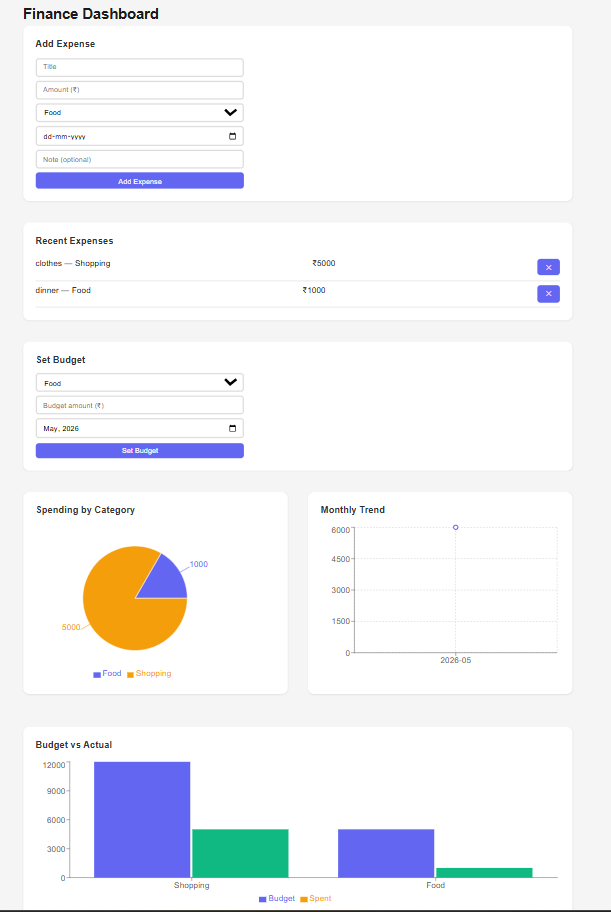
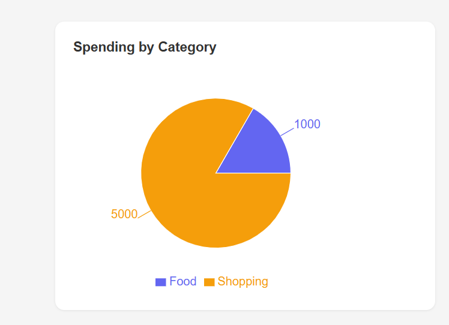
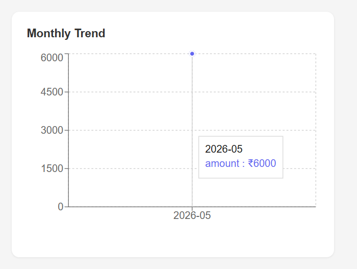
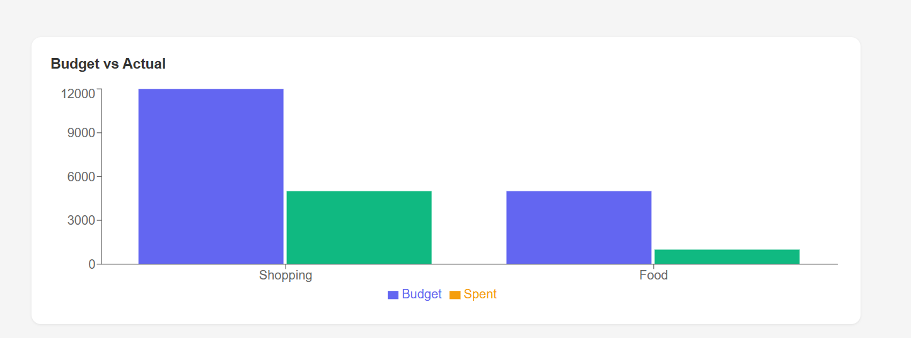

# Personal Finance Dashboard

🔗 **Live Demo:** [finance-dashboard-eight-ashen-75.vercel.app](https://finance-dashboard-eight-ashen-75.vercel.app)

A full stack finance tracking app with real time analytics built using MERN stack and Python.

## Tech Stack
- **Frontend:** React, Recharts, Axios
- **Backend:** Node.js, Express, MongoDB
- **Analytics:** Python, FastAPI, Pandas, NumPy

## Features
- Add and delete expenses by category
- Set monthly budgets per category
- Spending by category (pie chart)
- Monthly trend (line chart)
- Budget vs actual spending (bar chart)

## Architecture
Two separate servers: Node handles CRUD operations, Python/FastAPI handles all analytics and chart data. Both connect to the same MongoDB Atlas database.

## Screenshots

### Full Dashboard


### Spending by Category


### Monthly Trend


### Budget vs Actual


## Run locally

**Node server**
```bash
cd server
node index.js
```

**Python analytics**
```bash
cd analytics
uvicorn main:app --reload --port 8000
```

**React frontend**
```bash
cd client
npm run dev
```
